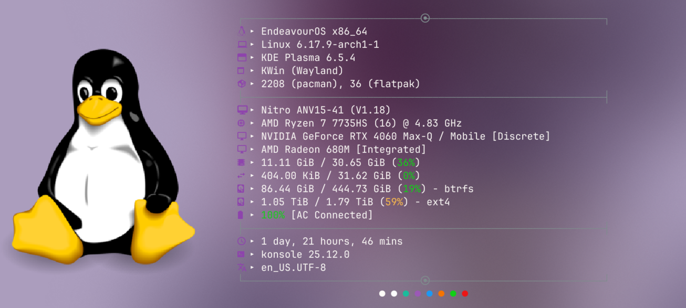
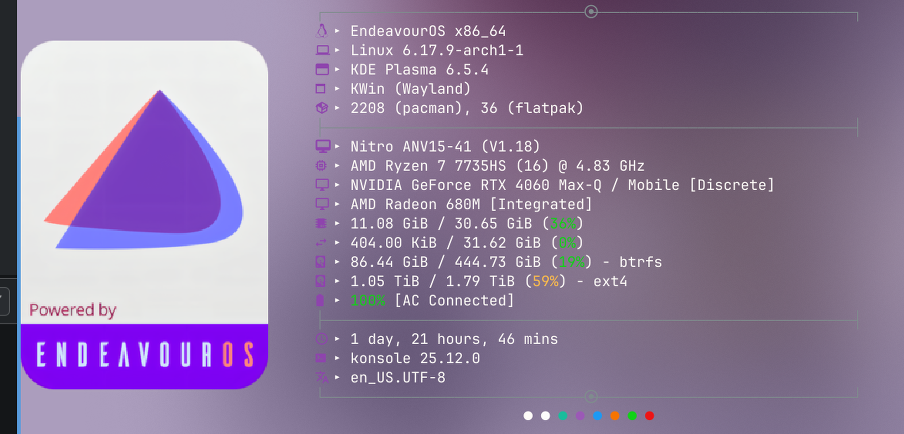
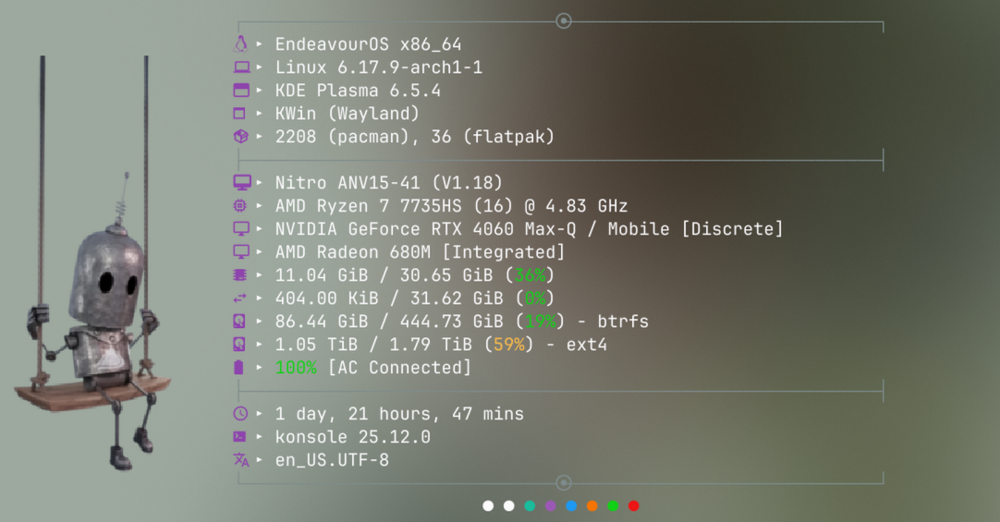

```
sudo pacman -Syu fastfetch imagemagick
 git clone https://github.com/raantss18/fastfetch.git ~/.config/fastfetch
```
<a id="installation"></a>  

---
> [!NOTE]
> _To display images in `*.png` format, set_:


